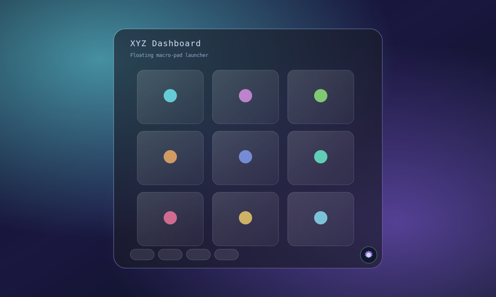
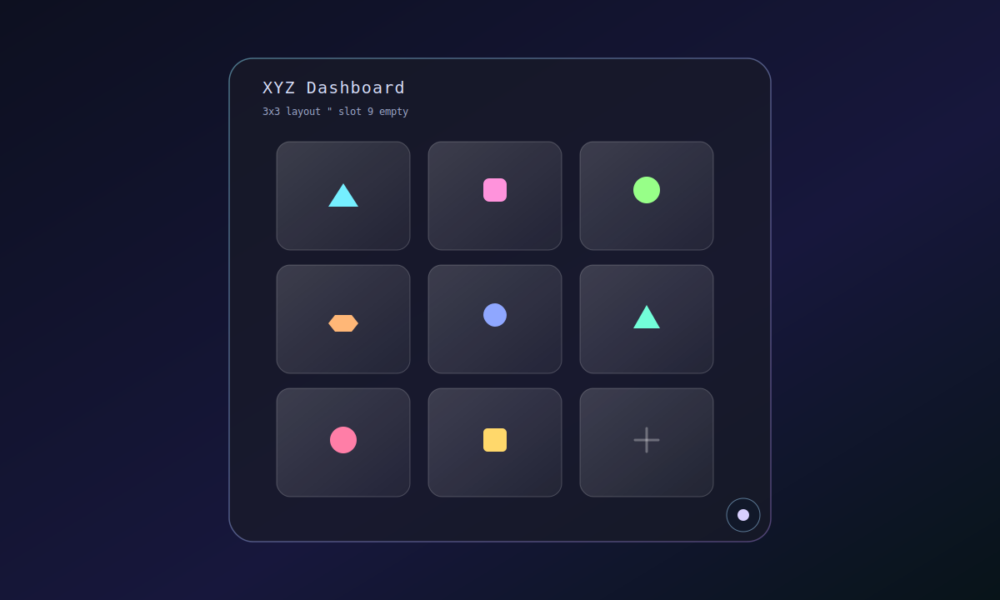

# XYZ Dashboard

<p align="center">
  
</p>


<p align="center">
  <a href="https://tauri.app/">
    
  </a>
  <a href="https://react.dev/">
    
  </a>
  <a href="https://www.typescriptlang.org/">
    
  </a>
  <a href="https://pnpm.io/">
    
  </a>
</p>

Floating macro-pad launcher built with **Tauri + React + TypeScript** to run commands and open URLs quickly.

## App Preview

<p align="center">
  
</p>

### 3x3 With Last Slot Empty

<p align="center">
  
</p>


## Table of Contents

- [What Is It](#what-is-it)
- [Features](#features)
- [Requirements](#requirements)
- [Install and Run](#install-and-run)
- [Build and Releases](#build-and-releases)
- [Repository Layout](#repository-layout)
- [Icon Packs Catalog](#icon-packs-catalog)
- [Documentation Assets (SVG)](#documentation-assets-svg)
- [Contributing](#contributing)
- [Roadmap](#roadmap)

## What Is It

XYZ Dashboard is a floating quick-access panel that centralizes frequent tasks:

- shell commands
- scripts and executables
- URLs
- custom iconized shortcuts

It is designed for users who want a compact, always-on-top launcher workflow.

<p align="center">
  
</p>

## Features

- Configurable button grid with paging by page size (rows/columns per page).
- Global shortcut to show/hide the dashboard.
- Command history shortcuts in tray menu.
- Script/executable picker with command suggestions and optional icon auto-suggestion from the executable path.
- Howler-based sound effects; **Settings → Sounds** (volume, output channel, test) plus global shortcut open/close sounds.
- Theme presets in Settings: **Lime**, **Cyber**, **Aurora**, **Darkmoon**.
- Multicolor theme mode: combine multiple presets and rotate a slow animated gradient around app borders.
- Settings UX refinements: fixed tabs + smooth internal scroll.
- Settings close/tab transitions hardened to avoid ghosting artifacts.
- Settings scroll reliability fix: proper internal tab scrolling with flex `min-h-0` constraints.
- Uniform visual scaling: full button UI (icon + label + spacing) grows with app scale.
- Linux GNOME audio hardening: layered playback fallbacks for better Debian/WebKit compatibility.
- Icon packs catalog with:
  - install/update actions
  - category accordion
  - search
  - sort by trending/downloads/newest
- Supports three icon sources:
  - built-in library (`lib:<id>`)
  - catalog refs (`pack:<pack-id>:<icon-id>`)
  - absolute file paths (resolved through Tauri file URL conversion)

### Características (ES)

- Rejilla de botones con paginación según tamaño de página (filas/columnas por página).
- Atajo global para mostrar/ocultar el panel.
- Historial de comandos desde el menú de bandeja.
- Selector de script/ejecutable con sugerencias de comando e icono opcional inferido desde la ruta del ejecutable.
- Sonido con Howler; **Ajustes → Sonidos** (volumen, salida de audio, prueba) y sonidos de abrir/cerrar con el atajo global.
- Temas predefinidos en Ajustes: **Lime**, **Cyber**, **Aurora**, **Darkmoon**.
- Modo multicolor: combina presets y anima un degradado lento en los bordes.
- Ajustes de UX: pestañas fijas y scroll interno suave.
- Transiciones de cierre y pestañas endurecidas para evitar artefactos fantasma.
- Scroll interno fiable en pestañas de Ajustes (flex `min-h-0`).
- Escalado visual uniforme: icono, etiqueta y espaciado crecen con el tamaño de la app.
- Audio en GNOME (Linux): reproducción por capas con respaldos para Debian/WebKit.
- Catálogo de icon packs:
  - instalar/actualizar packs
  - categorías en acordeón
  - búsqueda
  - orden por trending/descargas/novedades
- Tres fuentes de icono:
  - librería integrada (`lib:<id>`)
  - catálogo (`pack:<pack-id>:<icon-id>`)
  - rutas absolutas (resolución vía URL de archivo de Tauri)

## Latest Local Build Notes

- New app preview SVGs in README:
  - full app preview
  - 3x3 preview with last slot intentionally empty
  - theme cards preview
- New theme selector cards in Settings -> Appearance.
- New **Multicolor** mode in Settings -> Appearance with multi-select theme blending.
- Icon catalog grid orientation updated for top-to-bottom visual flow.
- Settings content area keeps tabs fixed and scrolls internally with smooth behavior.
- Buttons now scale uniformly when increasing app size percentage.
- Audio playback fallback chain improved for GNOME Debian environments.

## Changelog (Unreleased)

### Added

- Boot splash wordmark (`public/splash-logo.svg`) and `runBootWithSplash` so the HTML splash is removed after config load.
- Persisted `currentPage` in app config (with `gridSize` aligned to that page) so paging survives restarts without config drift.
- Theme presets in Settings: **Lime**, **Cyber**, **Aurora**, **Darkmoon**.
- **Multicolor** theme mode with multi-select preset blending.
- Rotating conic-gradient border animation for multicolor mode.
- App preview SVGs in README:
  - full app preview
  - 3x3 layout preview (last slot empty)
  - themes preview

### Changed

- Icon catalog visual flow in Settings updated to top-to-bottom grid orientation.
- Button visuals now scale uniformly with app size percentage (icon, label, spacing).
- README expanded with current feature set and visual previews.

### Fixed

- Page navigation now persists grid/page state consistently (`saveConfig` / `currentPage` in snapshot).
- Settings panel ghost transition artifacts reduced by simplifying transition flow.
- Internal Settings scrolling in tabs stabilized using proper flex/min-height constraints.
- Audio playback reliability improved on GNOME Debian with layered fallbacks.

## Requirements

- Node.js (recommended modern LTS)
- pnpm
- Rust toolchain
- OS dependencies required by Tauri for your platform

Project versions (keep [package.json](package.json) and [src-tauri/tauri.conf.json](src-tauri/tauri.conf.json) in sync when you cut a release):

- App version: `0.1.2`
- Frontend package version: `0.1.2`
- Tauri package version: `0.1.2`

## Install and Run

### Install dependencies

```bash
pnpm install
```

### Run in development

```bash
pnpm tauri dev
```

### Frontend build

```bash
pnpm build
```

### Rust backend check

```bash
cd src-tauri
cargo check
```

### Final verification (before tag / release)

Run all checks locally:

```bash
pnpm run build
pnpm run test
cd src-tauri && cargo build
```

Smoke-test in the desktop app (`pnpm tauri dev`): boot splash appears then clears; paging restores the last page after restart; settings persist.

## Build and Releases

Tagged releases use the version in `package.json` / `src-tauri/tauri.conf.json` (see [Requirements](#requirements)); push a `v*` tag to run `.github/workflows/release.yml`.

### GitHub Actions

| Workflow | Trigger | What it does |
|----------|---------|----------------|
| [`.github/workflows/ci.yml`](.github/workflows/ci.yml) | Push / PR to `master` or `main` | `pnpm build`, `pnpm test`, and `cargo build` on Ubuntu (fast CI; **no** installers). |
| [`.github/workflows/release.yml`](.github/workflows/release.yml) | Push tag `v*` or manual dispatch | Full **Tauri** builds: Linux `.AppImage` + `.deb` + `.rpm`, macOS `.dmg`, Windows NSIS `.exe`; uploads to the GitHub **Release**. |

Prefer **tagging** and letting `release.yml` produce official binaries instead of relying on local `pnpm tauri build` for distribution.

### Local app build

```bash
pnpm tauri build
```

### Release workflow

Release automation is configured in `.github/workflows/release.yml` and is triggered by pushing tags matching `v*`.

Official artifacts:

- Linux: `.AppImage`, `.deb`, and `.rpm`
- macOS: `.dmg`
- Windows: `.exe` (NSIS)

Create and push a tag:

```bash
git tag v0.1.2
git push origin v0.1.2
```

## Repository Layout

```text
src/                     # React UI, state, hooks, audio, icon catalog
public/                  # Static files for Vite (e.g. splash-logo.svg, app-icon.png)
src-tauri/               # Rust backend (commands, shortcuts, window, packaging)
assets/                  # Versioned visual assets + icon packs source
assets/icon-packs/       # Catalog index + packs metadata + svg/png icons
.github/workflows/       # ci.yml (checks) + release.yml (tagged installers)
```

## Icon Packs Catalog

Icon packs live in `assets/icon-packs/`:

```text
assets/icon-packs/
  index.json
  packs/
    <pack-id>/
      pack.json
      icons/
        *.svg|*.png
```

Core files:

- `index.json` (root fields):
  - `version`: integer schema version for the index file (currently `1`).
  - `updatedAt`: ISO 8601 UTC timestamp for the last catalog index refresh (bump when you change `index.json` or add/remove packs; distinct from per-pack `createdAt`). Helps track freshness across releases.
  - `packs[]`: entries with `id`, `name`, `description`, `categories`, `tags`, `createdAt`, `downloads`, `trendingScore`, `iconCount`, `coverIcon`, etc.
- `pack.json`: per-pack icon list (`id`, `relativePath`, `tags`, `appHints`, `category`, etc.)

### Adding or updating a pack

1. Create or edit `assets/icon-packs/packs/<pack-id>/` with `pack.json` and files under `icons/`.
2. Register the pack in `assets/icon-packs/index.json` (or update metrics).
3. Set `updatedAt` to the current UTC time. Increment `version` only if you change the shape or semantics of the index JSON (not for routine pack additions).

Usage flow in app:

1. Open **Settings -> Icons**
2. Install or update a pack
3. Pick target button
4. Apply icon
5. Config stores reference as `pack:<pack-id>:<icon-id>`

## Documentation Assets (SVG)

This repository includes multiple SVG assets referenced by this README and by the app:

- `assets/banner-main.svg`
- `assets/banner-features.svg`
- `assets/app-preview.svg`
- `assets/app-preview-3x3-last-empty.svg`
- `assets/themes-preview.svg`
- `assets/error.svg`
- `assets/settings.svg`
- `assets/icon-packs/packs/dev-tools/icons/terminal.svg`
- `assets/icon-packs/packs/apps-brands/icons/browser.svg`
- `assets/icon-packs/packs/system-controls/icons/power.svg`
- `assets/icon-packs/packs/media-social/icons/music.svg`

Preview row:

<p>
  
  
  
  
  
  
</p>

## Contributing

1. Create a branch from your local clone.
2. Keep changes scoped and small when possible.
3. Run checks before opening a PR (same as [Final verification](#final-verification-before-tag--release)):
   - `pnpm run build`
   - `pnpm run test`
   - `cd src-tauri && cargo build` (or `cargo check` for a faster compile-only pass)
4. In the PR description, include:
   - problem statement
   - implemented solution
   - verification steps

## License

[MIT](LICENSE) — Copyright © Rainbow Technology.

## Roadmap

- Import/export layout profiles.
- Local shortcut presets marketplace.
- More visual themes and icon tooling.
