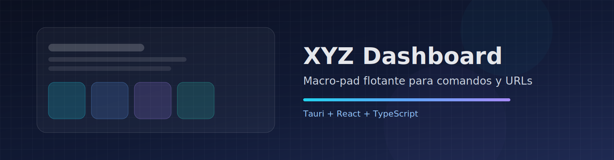
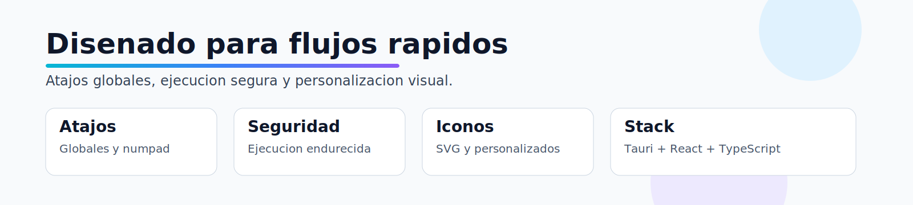

# XYZ Dashboard

<p align="center">
  
</p>

Floating macro-pad launcher creado con **Tauri + React + TypeScript** para ejecutar comandos y abrir URLs rapidamente desde un panel flotante.

<p align="center">
  
</p>

## Que es XYZ Dashboard

XYZ Dashboard es un lanzador visual de accesos rapidos tipo macro-pad:

- Define botones con comando, URL e icono.
- Abre/cierra el panel con atajo global.
- Organiza accesos para tareas frecuentes (desarrollo, sistema, herramientas, scripts).
- Mantiene historial de acciones para repetir tareas rapido.

## Funciones principales

- **Grid configurable** de botones para ejecutar acciones.
- **Atajo global** para mostrar/ocultar el dashboard.
- **Atajos de numpad** opcionales en layouts 3x3.
- **Historial en tray y ajustes** para recuperar acciones.
- **Soporte de iconos**:
  - Libreria SVG (Lucide).
  - Icono personalizado por selector de archivo.
  - Ruta manual de icono.
- **Selector de scripts/ejecutables**:
  - Integracion con el dialogo de archivos del sistema.
  - Sugerencias automaticas para `.py`, `.sh`, `.js` y binarios.
  - Deteccion de virtualenv Python (`.venv`, `venv`, `env`).

## Seguridad (estado actual)

La ejecucion de comandos esta endurecida para evitar riesgos comunes:

- Sin ruta de ejecucion `sh -c`.
- Parseo explicito de `program + args`.
- Bloqueo de caracteres de control de shell: `;`, `|`, `&`, `$`, `` ` ``, `<`, `>`, saltos de linea.
- El programa debe ser:
  - Ruta absoluta, o
  - Uno de los permitidos: `python`, `python3`, `bash`, `node`, `npm`, `pnpm`, `yarn`, `firefox`, `xdg-open`, `code`.

## Stack tecnico

- **Frontend**: React + TypeScript
- **Desktop shell**: Tauri (Rust)
- **Package manager**: pnpm

## Instalacion y desarrollo

### Requisitos

- Node.js
- pnpm
- Rust toolchain
- Dependencias de Tauri para tu sistema operativo

### Ejecutar en desarrollo

```bash
pnpm install
pnpm tauri dev
```

### Build de frontend

```bash
pnpm build
```

### Verificacion de backend (Rust)

```bash
cd src-tauri
cargo check
```

## Build de app y releases

Los artefactos `.deb` se guardan en `releases/` y estan ignorados en git por `.gitignore`.

Flujo recomendado:

1. Generar build de Tauri.
2. Copiar los `.deb` resultantes a `releases/`.
3. Versionar solo codigo y assets (no los binarios de release).

## Assets para documentacion

La carpeta `assets/` esta pensada para recursos visuales del proyecto (banners, iconos SVG para README, etc.) y **si se versiona** en git.

Ejemplos actuales:

- `assets/banner-main.svg`
- `assets/banner-features.svg`
- `assets/error.svg`
- `assets/settings.svg`

## Documentacion extra

- Guia adicional: `docs.md`

## Roadmap sugerido

- Perfiles de layouts exportables/importables.
- Marketplace local de atajos preconfigurados.
- Temas visuales y editor de iconos integrado.
